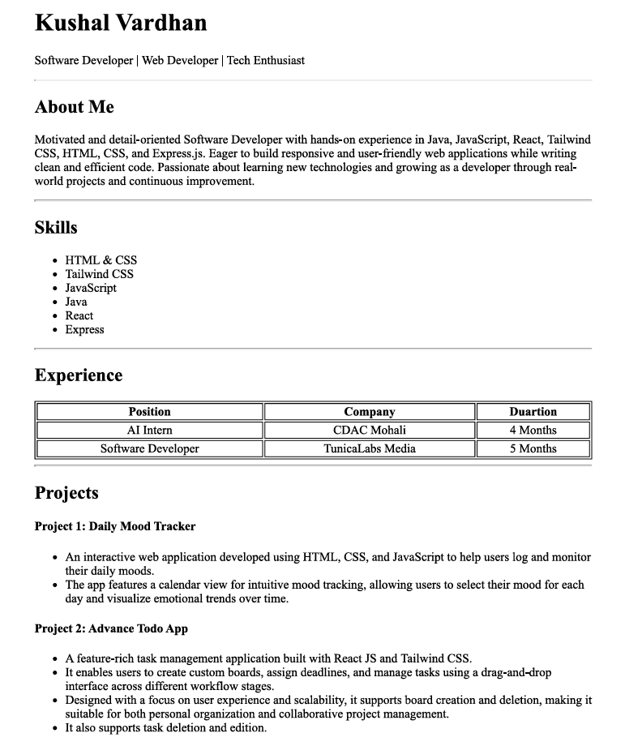
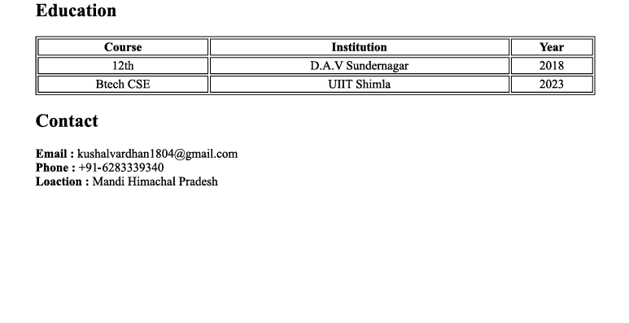

# Resume Page Website 


### Description
- An assignment to Learn and practice the HTML. 
- In this assignment we have created Resume page website using HTML and Serve it on live Server.
---
### Setup
```bash
git clone https://github.com/Kushalvardhan18/web-dev-cohort-2026.git
```
1. Open folder with vsCode or with any other IDE.
2. Serve the HTML file on the live server.
---

### Tech Stack
- HTML 

---

### Screenshot



---

### Link 
[Github](https://github.com/Kushalvardhan18/web-dev-cohort-2026)
 